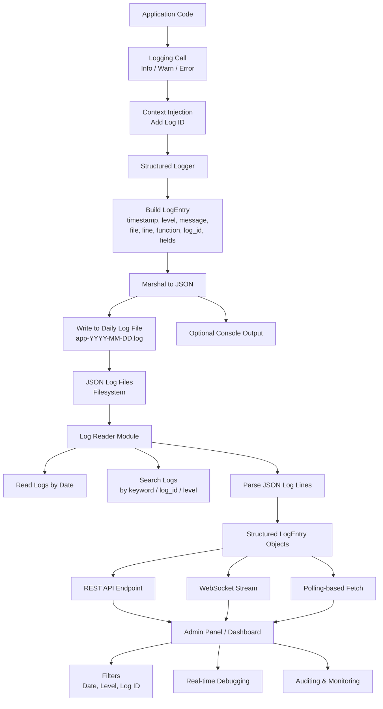

# go-logger

A single Go package that provides a structured logger (file rotation, context-aware log IDs) and a log reader/search utility to parse and search produced logs.

## Install

```bash
go get github.com/shekhar8352/go-logger
```

## Usage

### 1. Basic Logging

Initialize the logger with a default configuration or custom settings.

```go
package main

import (
	"context"
	"github.com/shekhar8352/go-logger/logger/logging"
)

func main() {
	// Initialize default logger
	// This will create logs in ./logs directory by default
	lg := logging.NewLogger(logging.DefaultConfig())
	defer lg.Close()

	// Create a context with a unique Log ID
	ctx := logging.AddLogID(context.Background())

	// Log messages
	lg.Info(ctx, "Application started")
	lg.Error(ctx, "Something went wrong: %v", "connection refused")

	// Optional tracing ids from an incoming request (omitted from JSON when unset)
	ctx = logging.WithLogID(ctx, "req-header-id")
	ctx = logging.WithRequestID(ctx, "req-1")
	ctx = logging.WithTraceID(ctx, "tr-1")
	ctx = logging.WithUserID(ctx, "user-9")
	lg.Info(ctx, "handling request")
}
```

### 2. Structured fields and child loggers

Attach key-value fields to a single entry, or create a **child logger** that includes the same fields on every line. Fields are serialized as a nested JSON object and omitted when empty.

```go
package main

import (
	"context"
	"github.com/shekhar8352/go-logger/logger/logging"
)

func main() {
	lg := logging.NewLogger(logging.DefaultConfig())
	defer lg.Close()

	ctx := logging.AddLogID(context.Background())

	// Child logger: these fields appear on every entry it writes
	reqLog := lg.WithFields(map[string]interface{}{
		"user_id": 123,
		"role":    "admin",
	})
	reqLog.Info(ctx, "request started")
	reqLog.WithField("path", "/orders").Error(ctx, "handler failed")

	// Per-call fields via context (merged with logger fields)
	ctx = logging.ContextWithField(ctx, "request_id", "req-1")
	lg.Info(ctx, "plain logger with context fields")
}
```

### 3. Log format and timestamps

JSON is the default. Set `LogFormat` to `logfmt` for key=value lines, and `TimestampFormat` to `time.RFC3339` (default), `logging.TimestampUnixMs`, or any `time.Format` layout.

```go
cfg := logging.DefaultConfig()
cfg.LogFormat = logging.FormatLogfmt
cfg.TimestampFormat = logging.TimestampUnixMs
lg := logging.NewLogger(cfg)
```

### 4. Rotation, retention, and compression

Daily rotation is always on. Size rotation, retention, and gzip are off unless configured (`0` / `false` keeps the previous behavior).

```go
cfg := logging.DefaultConfig()
cfg.MaxFileSize = 10 << 20 // rotate the current file at 10 MiB
cfg.RetentionDays = 7      // delete files older than 7 days
cfg.MaxBackups = 20        // keep at most 20 archived files
cfg.CompressRotated = true // gzip files after they are rotated away
```

Size-rotated files are named `app-YYYY-MM-DD.N.log` (then `.log.gz` when compression is enabled). The active file is never gzipped.

### 5. Async writer, console routing, and extra sinks

Set `UseAsyncWriter` to buffer writes on a background goroutine (`Close()` flushes what is still queued). `StderrLevels` sends matching console lines to stderr; everything else stays on stdout. `Sinks` get a copy of every line.

```go
cfg := logging.DefaultConfig()
cfg.UseAsyncWriter = true
cfg.AsyncBufferSize = 256
cfg.FlushInterval = time.Second
cfg.IncludeConsole = true
cfg.StderrLevels = []string{logging.LevelError, logging.LevelWarn}
cfg.Sinks = []io.Writer{metricsWriter}
```

### 6. Search & Read Logs

You can programmatically search through generated logs.

```go
package main

import (
	"fmt"
	"github.com/shekhar8352/go-logger/logger/logging"
)

func main() {
	// Search for "error" in logs from the last 7 days
	// Args: query, date (YYYY-MM-DD or empty for recent), level
	logs, count, err := logging.SearchLogs("error", "", "")
	if err != nil {
		fmt.Printf("Error searching logs: %v\n", err)
		return
	}

	fmt.Printf("Found %d error logs:\n", count)
	for _, l := range logs {
		fmt.Printf("[%s] %s\n", l.Timestamp, l.Message)
	}
}
```

## How it Works

The package is designed to be a self-contained logging solution that covers the lifecycle from log generation to retrieval.



## Examples

Check the [examples/README.md](logger/examples/README.md) for detailed usage instructions and real-world scenarios:

- **Basic Usage**: Simple logging setup.
- **Search**: Querying and parsing logs.
- **HTTP Middleware**: Context-aware logging in a web server.
- **Advanced Config**: Dynamic configuration and runtime level changes.

## Benchmarks

The logger is optimized for low latency and minimal interaction with the garbage collector.

**Hardware**: Apple M4
**Results**:

| Benchmark                       | Operations/sec | Time/Op  |
| :------------------------------ | :------------- | :------- |
| `BenchmarkLogger_Info`          | ~1.2M          | 996.9 ns |
| `BenchmarkLogger_Info_WithArgs` | ~1.0M          | 1062 ns  |
| `BenchmarkLogger_Silent`        | ~3.7M          | 322.7 ns |
| `BenchmarkLogger_CreateEntry`   | ~2.9M          | 408.0 ns |

To run benchmarks yourself:

```bash
go test -bench=. ./logger/logging/...
```

## Publishing

1. Create repository `github.com/shekhar8352/go-logger` and push files.
2. Tag a release: `git tag v1.0.0 && git push origin v1.0.0`.
3. Users can `go get github.com/shekhar8352/go-logger`.

## Files

This repo exposes the `logging` package. See file comments for APIs.
