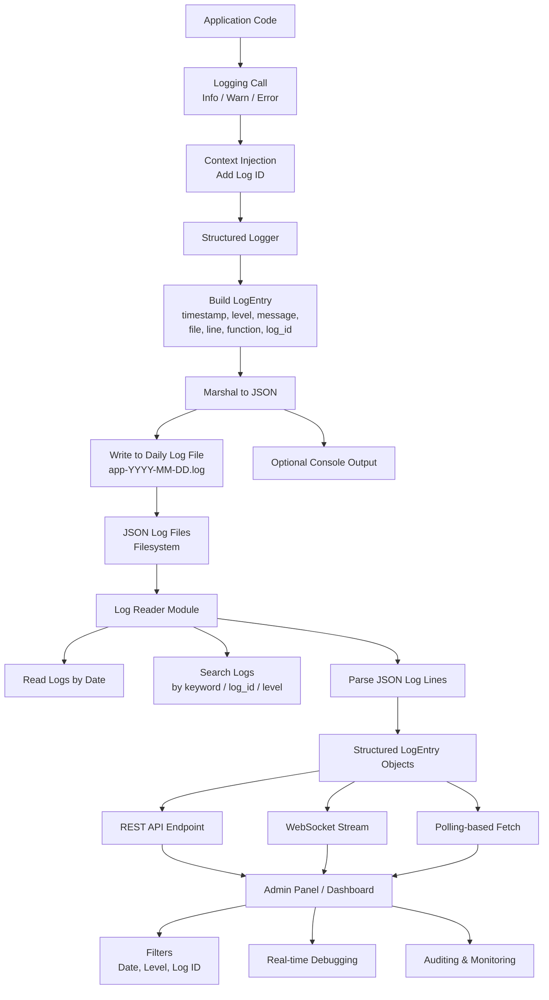

# go-logger

A single Go package that provides a structured logger (file rotation, context-aware log IDs) and a log reader/search utility to parse and search produced logs.

## Install

```bash
go get github.com/shekhar8352/go-logger
```

## Usage

### 1. Basic Logging

Initialize the logger with a default configuration or custom settings.

```go
package main

import (
	"context"
	"github.com/shekhar8352/go-logger/logger/logging"
)

func main() {
	// Initialize default logger
	// This will create logs in ./logs directory by default
	lg := logging.NewLogger(logging.DefaultConfig())
	defer lg.Close()

	// Create a context with a unique Log ID
	ctx := logging.AddLogID(context.Background())

	// Log messages
	lg.Info(ctx, "Application started")
	lg.Error(ctx, "Something went wrong: %v", "connection refused")
}
```

### 2. Search & Read Logs

You can programmatically search through generated logs.

```go
package main

import (
	"fmt"
	"github.com/shekhar8352/go-logger/logger/logging"
)

func main() {
	// Search for "error" in logs from the last 7 days
	// Args: query, date (YYYY-MM-DD or empty for recent), level
	logs, count, err := logging.SearchLogs("error", "", "")
	if err != nil {
		fmt.Printf("Error searching logs: %v\n", err)
		return
	}

	fmt.Printf("Found %d error logs:\n", count)
	for _, l := range logs {
		fmt.Printf("[%s] %s\n", l.Timestamp, l.Message)
	}
}
```

## How it Works

The package is designed to be a self-contained logging solution that covers the lifecycle from log generation to retrieval.



## Publishing

1. Create repository `github.com/shekhar8352/go-logger` and push files.
2. Tag a release: `git tag v1.0.0 && git push origin v1.0.0`.
3. Users can `go get github.com/shekhar8352/go-logger`.

## Files

This repo exposes the `logging` package. See file comments for APIs.
